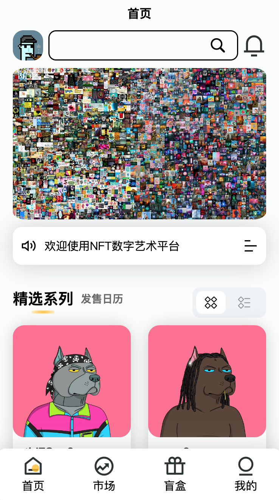

# NFT大师项目(微信:TRC-20TRX)

### 1.简介
> 项目NFT可以拍卖方式二次销售,无二级市场，合法合规。NFT每次的拍卖纪录,价格有纪录展示，公开透明。目前有盲盒,合成,铸造等玩法。

### 2.价格
| 版本  | 价格  | 功能 |
| ------------ | ------------ |------------ |
| 基础版  | 2000  | 全部基础功能，源码加密|
| 进阶版  | 8000  | 全部基础功能，代码授权独立部署。可开坑位(基础版)。源码加密|
| 二开版  | 30000 | 在进阶版的基础上开放源码，无需授权无代码加密|

### 3.上链
> 可上私链，公链，联盟链。您能想到的，都能上。各种链[介绍](https://blog.csdn.net/susieweijs/article/details/125718689)

### 4.PS

1. 当前售卖版本是没有上链
2. 上链看你选择什么链，每个链成本不一样
3. 可以代上链，费用成本费+上链费用(链归属方收)